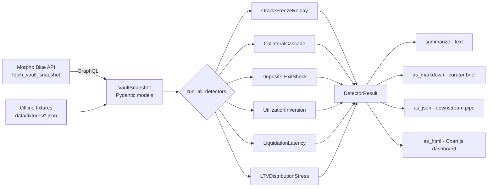

# morpho-vault-counterfactuals

**Historical replay + counterfactual stress testing for Morpho MetaMorpho vaults.**

[](https://github.com/mkzung/morpho-vault-counterfactuals/actions/workflows/ci.yml)
[](https://www.python.org/downloads/)
[](https://mypy.readthedocs.io/)
[](https://github.com/astral-sh/ruff)
[](LICENSE)
[](https://pre-commit.com/)

A Python framework that asks: *"if oracle X had frozen at block T, or if the top depositor exited during a fast market move, or if collateral price step-shocks −20% in one block — how much of this vault's debt would have become bad debt, and how much depositor capital would have been rationed at the withdraw queue?"*

This is curator-side counterfactual reasoning, the kind of question a Morpho curator (Re7 Labs, Steakhouse, MEV Capital, Block Analitica) needs to answer before they raise an LLTV, increase a supply cap, or admit a new market into a managed vault.

🔍 **Live demo (no clone needed):** [**mkzung.github.io/morpho-vault-counterfactuals**](https://mkzung.github.io/morpho-vault-counterfactuals/) — pre-rendered HTML dashboards on demo fixtures.

📡 **Live mainnet data:** [`live-data/`](./live-data/) — a nightly GitHub Actions cron fetches the current state of the real [Steakhouse USDC vault](https://etherscan.io/address/0xBEEF01735c132Ada46AA9aA4c54623cAA92A64CB) (>$120M TVL on Ethereum mainnet) and commits a fresh HTML/JSON/Markdown report. The repo doubles as a public time-series of curator metrics for one of Morpho's flagship vaults.

🎛 **Interactive Streamlit dashboard:** `streamlit run streamlit_app.py` after `pip install streamlit`.

---

## What this framework does (and what it deliberately does not)

**Does:**
- Pulls Morpho MetaMorpho vault state from the Morpho Blue API (or a pinned-block fixture for reproducibility).
- Runs six counterfactual detectors against the snapshot — each isolates one failure mode a real curator monitors weekly.
- Emits a single fractional risk number per detector + a per-market `evidence` dict so the curator can audit the reasoning.
- Ships with offline tests + a Jupyter notebook anyone can clone and re-run end-to-end.

**Does not:**
- Submit transactions. This is a read-only analytical layer.
- Replace the official [`@morpho-org/vault-risk-sdk`](https://github.com/morpho-org/vault-risk-sdk) — that SDK measures *current* risk; this framework measures *counterfactual* risk under one specific adverse hypothesis.
- Provide good/bad labels. Risk is reported as fractional bad-debt or fractional impairment; curators set the threshold for their book.

## The six detectors

| Detector | What counterfactual it answers |
|---|---|
| `OracleFreezeReplay` | If the oracle freezes while collateral drifts X%, how much debt becomes unliquidatable until the next oracle update? |
| `CollateralCascade` | At a −10%/−20%/−30% step shock on collateral, how much debt becomes liquidatable, and is there enough idle loan-asset supply to absorb the liquidation wave? |
| `DepositorExitShock` | If the top-N depositors exit simultaneously, what fraction of redemptions gets queue-rationed because supply is currently lent out? |
| `UtilizationInversion` | Which markets are already past the curator's target utilization band — signaling IRM curves into the steep regime? |
| `LiquidationLatency` | At current gas + ETH prices, what fraction of debt sits in positions too small to be profitable to liquidate (so they accrue bad-debt risk during oracle shocks)? |
| `LTVDistributionStress` | What fraction of debt is within 5pp of LLTV today — i.e., where a small adverse oracle move triggers a liquidation? |

The six-detector + reproducible-replay shape is borrowed from my [Inca Challenge #492](https://github.com/mkzung/ethbtc-suspicious-patterns) framework (forensic on-chain detection on ETH/BTC markets — pytest 46/46, public dashboard) and re-applied to a new domain.

## Architecture at a glance



Pure-function detectors. All I/O isolated in `fetch.py`. Same snapshot in, same metrics out — bit-for-bit reproducible.

## Quick start

```bash
git clone https://github.com/mkzung/morpho-vault-counterfactuals.git
cd morpho-vault-counterfactuals
pip install -e ".[dev]"
pytest tests/                                          # ~1s, no RPC required
jupyter notebook notebooks/01_demo.ipynb               # walk through detectors
```

### CLI

`pip install -e .` installs an `mvcf` console script:

```bash
mvcf analyze --fixture steakhouse_usdc_snapshot_demo                       # text summary
mvcf analyze --fixture steakhouse_usdc_snapshot_demo --format markdown     # curator brief
mvcf analyze --fixture steakhouse_usdc_snapshot_demo --format json         # for piping
mvcf analyze --vault 0xBEEF01735c132Ada46AA9aA4c54623cAA92A64CB            # live fetch
mvcf sweep collateral --fixture steakhouse_usdc_snapshot_demo \
        --shocks=-0.05,-0.10,-0.20,-0.30,-0.50                             # sensitivity sweep
```

### Python API

```python
from mvcf import load_fixture, run_all_detectors, summarize, as_markdown
snap = load_fixture("steakhouse_usdc_snapshot_demo")
results = run_all_detectors(
    snap,
    oracle_drift=-0.10,          # 10% collateral drift while oracle is stale
    collateral_shock=-0.20,      # 20% collateral price cliff
    top_n_exit=1,                # top-1 depositor exits
    util_band=0.92,              # utilization above this triggers a flag
    gas_gwei=30,                 # current gas-price assumption for liq cost
)
print(summarize(results))                              # human-readable text
brief = as_markdown(snap, results)                     # paste-ready curator brief
```

Sample output:
```
── Vault counterfactual risk summary ──

[OracleFreezeReplay]  0.025 fraction_bad_debt
  → If oracle freezes while collateral drifts -10%, 2.5% of outstanding debt
    (1 position) would breach liquidation threshold but remain unliquidatable
    until oracle updates.

[CollateralCascade]   0.121 fraction_liquidatable_debt
  → At a -20% collateral shock, 12.1% of debt becomes liquidatable; liquidity
    gap (debt minus idle supply) is 0 loan-asset units across affected markets.
...
```

## Architecture

```
src/mvcf/
├── state.py       # Domain models: VaultSnapshot, MarketState, BorrowerPosition.
│                  # Pure Pydantic. No I/O.
├── detectors.py   # 6 counterfactual detectors. Pure functions on snapshots.
├── runner.py      # Orchestrator + summarizer.
└── fetch.py       # I/O frontier: Morpho Blue API client + fixture loader.
                   # KEPT SEPARATE so tests stay offline.

data/fixtures/     # Pinned-block JSON snapshots for reproducibility.
tests/             # pytest, offline, deterministic.
notebooks/         # Jupyter walkthroughs of the core logic.
```

**Design choices and trade-offs:**

1. **Pure-function detectors.** No detector touches the network. Re-running on a fixture must give identical results bit-for-bit. This is the same posture the Inca Challenge framework adopted — reproducibility is the gate for analytical trust.

2. **Decimal handling.** Morpho's oracle convention is `price = real_price × 10^(36 + loan_decimals − collateral_decimals)`. The fixture is hand-tuned to this convention, and the `BorrowerPosition.ltv()` math is the same operation Morpho Blue performs in `MarketLib.sol`. Verified by hand-calculation in the LTV unit tests.

3. **Counterfactual ≠ probabilistic.** This framework does not assign probabilities to the scenarios. A curator does. We tell them "*if* X, *then* Y" — they decide which X is worth worrying about this week.

4. **Operator-side framing.** I am applying to DeFi associate roles, not claiming to have run a production liquidation bot. The shape of this framework is what a curator's *internal monitoring tooling* looks like — periodic snapshot ingestion, counterfactual replay, alerting on threshold breach. That is research-flavored work, which is what I am qualified to do.

## Honest disclosure

- I have not personally curated a live Morpho vault. This framework is the work product I would build on day one if hired into a curation/risk-research role.
- My on-chain reps come from [Inca Challenge #492](https://github.com/mkzung/ethbtc-suspicious-patterns) (forensic detection on ETH/BTC microstructure, pytest 46/46 CI, public repo + dashboard). DeFi risk math is adjacent — same primary-source discipline, different protocol primitives.
- Numbers in `data/fixtures/` are illustrative (correct units, correct math, scaled-down magnitudes). For real curation, replace with `fetch_vault_snapshot()` against the Morpho Blue API and pin to a recent block.

## Reading list — what I read while building this

- [Morpho Blue whitepaper](https://github.com/morpho-org/morpho-blue) — the trust-minimized lending primitive itself; LLTV semantics, oracle conventions, liquidation incentive multiplier.
- [MetaMorpho v1.1 docs](https://github.com/morpho-org/metamorpho-v1.1) — vault layer; supply cap mechanics, withdraw queue, reallocation flow.
- [`@morpho-org/vault-risk-sdk`](https://github.com/morpho-org/vault-risk-sdk) — official TS SDK measuring *current* risk; this framework is the *counterfactual* complement.
- [Re7 Labs research](https://re7labs.xyz/) — curator perspective on lending/restaking vault parameter selection.
- [Block Analitica](https://github.com/blockanalitica) and [Risk DAO](https://github.com/Risk-DAO) — adjacent public risk tooling, useful frame of reference.

## License

MIT — see [LICENSE](LICENSE).

---

*Author: Maxim Gorbuk — CS founder, Stanford GSB Venture Capital Initiative research affiliate, Bocconi MSc INTENT incoming. Open to DeFi associate / curator research roles. See [linkedin.com/in/gorbuk](https://linkedin.com/in/gorbuk) and [github.com/mkzung](https://github.com/mkzung).*
